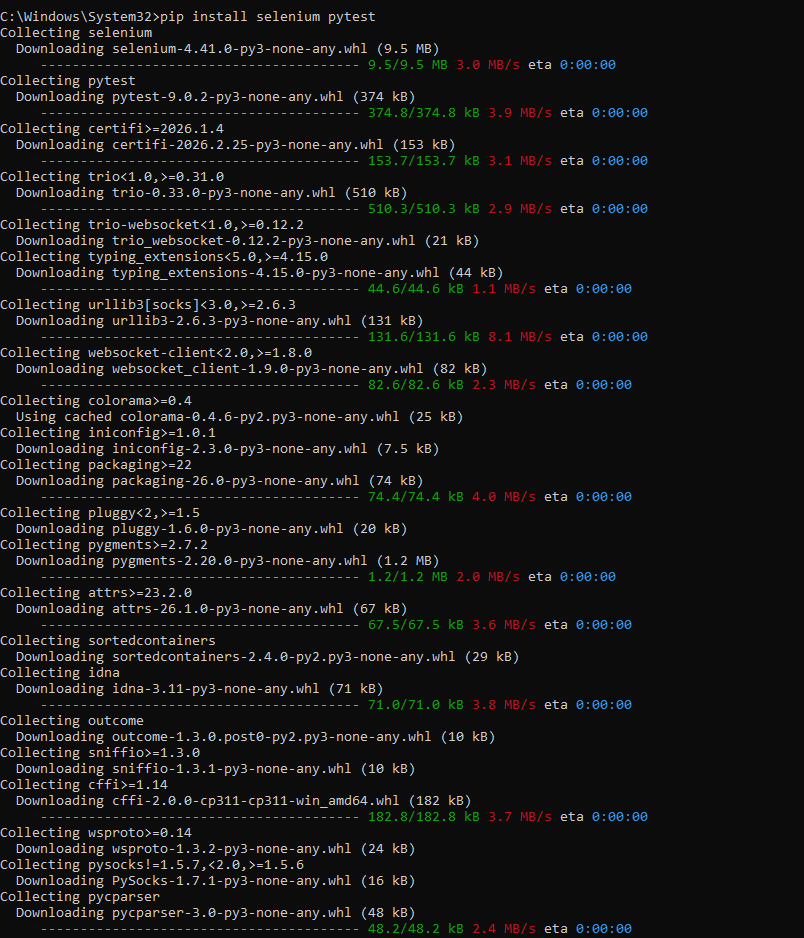
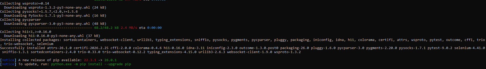

# **Testing Twitch page**

This repository is used to test basic functionality ofTwitch page.

## Clone/Download selenium_pytest code

1. Clone selenium_pytest repository
   ssh: git@github.com:angelikakos/selenium_pytest.git
   http: https://github.com/angelikakos/selenium_pytest.git
2. Make sure that the repository structure is the same as shown below:
```
    .\
     |
     pages
        |--- twitch_page.py
     |
     tests
        |--- test_twitch_page.py
     |
     conftest.py
```

3. Precondition:
   1. Install python 3 version from e.g. from the following page: https://www.python.org/downloads/
   2. Make sure that pip was installed with python 3
   3. Open command prompt
   4. Run the following command:
      `pip install selenium pytest`
   5. Result of execution of the command from the 4th point could be as follow
      
      

3. Postcondition:
   1. Remove test.log before the re-execution of test, because the new log would be added to the mentioned log file.

## Run Test

1. Run test directory: '{repo_root}',
2. Run command prompt/Run PyCharm
3. Command to run test
   `pytest`

### The example of running and execution test:

#### Command Prompt


#### PyCharm

